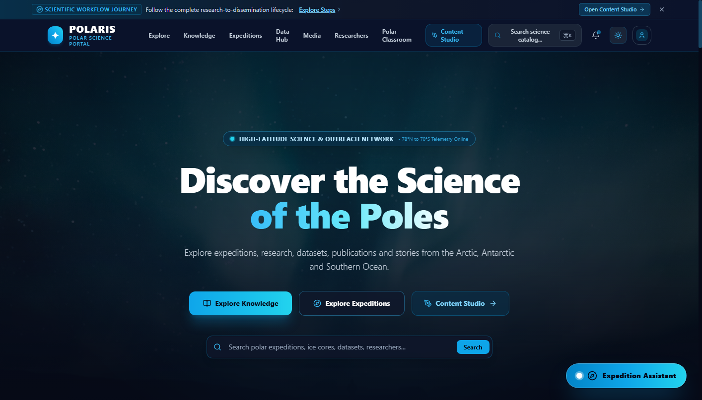
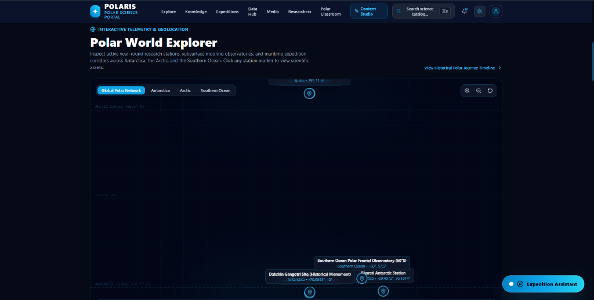
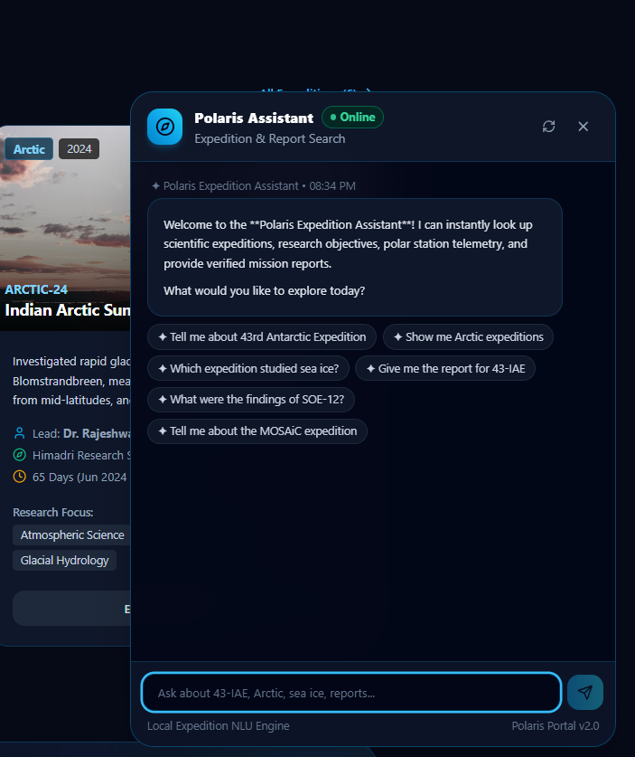
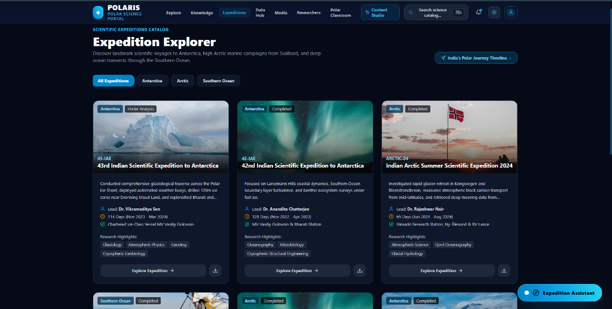

# POLARIS: Polar Science Knowledge & Outreach Portal

[](https://nextjs.org/)
[](https://react.dev/)
[](https://www.typescriptlang.org/)
[](https://tailwindcss.com/)
[](https://polaris-portal-taupe.vercel.app)
[](LICENSE)

> A unified digital platform for discovering polar research expeditions, scientific datasets, monographs, researcher profiles, and public science outreach across Antarctica, the Arctic, and the Southern Ocean.

---

## 1. Project Title & Tagline

**POLARIS – Polar Science Knowledge & Outreach Portal**  
*Connecting Four Decades of Polar Science, Cryospheric Field Discoveries, and Public Outreach in a Unified Digital Experience.*

---

## 2. Live Demo

The production application is deployed on **Vercel** and can be accessed at:

🌐 **Live URL**: [https://polaris-portal-taupe.vercel.app](https://polaris-portal-taupe.vercel.app)

---

## 3. Overview

Polar scientific exploration generates critical insights into global climate stability, ice sheet mass balance, atmospheric chemistry, and marine ecosystems. However, findings are historically dispersed across isolated expedition logs, disparate data formats, institutional repositories, and academic publications.

**POLARIS** unifies these high-latitude scientific assets into an interactive web platform. It serves a dual mission:
1. **Scientific Repository**: Providing researchers and students with rapid access to cataloged expeditions, peer-reviewed scientific monographs, sensor datasets, and investigator directories.
2. **Science Communication Hub**: Transforming complex research into accessible narratives, educational classroom modules, interactive mastery quizzes, and multi-channel editorial workflows via the Content Studio.

---

## Screenshots

### POLARIS Home


### Interactive Polar World Explorer


### Polaris Expedition Assistant


### Expedition Explorer


---

## 4. Key Features

- **Interactive Polar Station Map**: Vector-projected polar map with coordinate translation, research base markers, and voyage tracks.
- **Polaris Expedition Assistant**: Client-side conversational assistant with natural language query routing, topic scoring, and direct report generation.
- **Client-Side PDF Generator**: Instant compilation of publication-grade A4 scientific expedition dossiers formatted strictly as `expedition-name-report.pdf`.
- **Open Polar Data Hub**: Searchable dataset catalog with integrated time-series line charts, spatial bounding boxes, and CSV data exports.
- **Knowledge & Report Repository**: Searchable archive of scientific monographs, technical reports, and field assessments with executive summaries and DOI links.
- **Content Studio & Editorial Kanban**: Algorithmic science communicator that synthesizes articles, press briefs, social posts, and video scripts in English and Hindi with review workflows.
- **Polar Classroom & Mastery Quiz**: Educational learning modules and an interactive quiz engine providing immediate scientific explanations.
- **Media Archive & Lightbox**: High-resolution photography, aerial footage, 360-degree panoramas, and hydrophone audio with EXIF metadata.
- **Global Search**: Instant `Ctrl+K` search modal and federated multi-category search page across all entities.

---

## 5. Expedition Assistant

The **Polaris Expedition Assistant** (accessible via the floating launcher button) is an intelligent, client-side conversational interface that enables users to query polar campaigns without manually browsing the entire catalog.

### Technical Architecture & Logic
- **Engine**: Deterministic TypeScript NLP and scoring engine (`lib/assistant/expeditionAssistantEngine.ts`).
- **Processing Capabilities**:
  - **Intent Detection**: Recognizes conversational greetings, capabilities inquiries, explicit report download requests, and findings inquiries via regular expression matching.
  - **Term Normalization & Tokenization**: Sanitizes input tokens, strips punctuation, and normalizes synonyms (e.g., `43rd`, `43-iae`, `forty third`).
  - **Fuzzy Matching**: Matches colloquial and informal queries to canonical expedition codes and titles.
  - **Weighted Keyword Scoring**: Scans expedition summaries, primary objectives, voyage highlights, research domains, and report abstracts against domain keyword vectors (e.g., *sea ice*, *ice cores*, *black carbon*, *oceanography*).
  - **Researcher Lookup**: Direct lookup connecting Chief Scientists and investigators to their respective campaigns.
  - **Out-of-Catalog Handling**: Understands queries regarding major international polar projects (e.g., Germany's *MOSAiC* expedition) and provides historical context while guiding users to indexed national Arctic campaigns (e.g., *ARCTIC-24* at Ny-Ålesund).
  - **Direct Action Triggers**: Emits structured message payloads that attach interactive **"Download Report"** buttons and suggested follow-up chips directly within the conversation stream.

*Note: The assistant runs entirely client-side using deterministic TypeScript logic without external LLM APIs, vector databases, or remote generative endpoints, ensuring zero latency and predictable results.*

---

## 6. PDF Report Generation

POLARIS features a publication-grade, client-side PDF document generator powered by **jsPDF** (`utils/downloadUtils.ts`).

### Document Specifications
- **Filename Convention**: Guaranteed compliance with the standard pattern:  
  `expedition-name-report.pdf` (e.g., `43rd-indian-scientific-expedition-to-antarctica-report.pdf`).
- **Document Structure**:
  - **Cover Header Banner**: Deep polar navy header (`#0A192F`) with sky-blue repository classification tag (`POLARIS HIGH-LATITUDE SCIENCE REPOSITORY • PUBLIC OPEN ARCHIVE`).
  - **Expedition Identity**: Mission title, expedition code, operational window, region, and status badge.
  - **Metadata Card**: Structured slate card detailing Lead Scientist, Operational Base/Vessel, Field Personnel count, Expedition Year, and Participating Institutions.
  - **Section 1 — Mission Overview & Description**: Comprehensive scientific context and operational scope.
  - **Section 2 — Primary Scientific Objectives**: Numerically formatted bullet points with dynamic multi-line wrapping.
  - **Section 3 — Voyage Highlights & Field Milestones**: Field records, logistics achievements, and sensor deployments.
  - **Section 4 — Associated Scientific Reports & Findings**: Linked peer-reviewed reports with executive abstracts, DOIs, and enumerated key findings.
  - **Section 5 — Official Archive Citation**: Formal citation with unique Polaris Document ID.
  - **Typography & Pagination**: Helvetica font hierarchy, automated page-break calculation (`checkPageBreak`), continuation headers, and running page-numbered footers (`"Page X of Y"` and verification mark).
- **Client-Side Trigger**: Uses in-memory Blobs (`application/pdf`) with ephemeral object URLs (`URL.createObjectURL`) and automatic garbage collection cleanup (`URL.revokeObjectURL`) after 2,500ms to prevent browser memory leaks on desktop and mobile.

---

## 7. Interactive Polar Map

The interactive polar map (`components/maps/PolarMap.tsx`) provides geospatial discovery across polar research stations and maritime tracks:

- **Mathematical Projection**: Uses a vector coordinate translation engine mapping latitude `[-90, 90]` and longitude `[-180, 180]` directly to SVG canvas coordinates.
- **Indexed Stations**:
  - **Bharati Station**: Larsemann Hills, East Antarctica (69.40°S, 76.19°E)
  - **Maitri Station**: Schirmacher Oasis, Central Dronning Maud Land (70.76°S, 11.73°E)
  - **Himadri Station**: Ny-Ålesund, Spitsbergen, Svalbard (78.92°N, 11.92°E)
  - **IndARC Observatory**: Kongsfjorden Moored Underwater Array (78.98°N, 12.01°E)
  - **Dakshin Gangotri**: Ice Shelf Historic Site (70.08°S, 12.00°E)
- **Voyage Tracks**: Visualizes multi-stage shipping routes (Goa → Cape Town → Larsemann Hills) and continental overland ice traverses.
- **Controls**: Mouse drag-to-pan, interactive zoom controls, region filtering, and responsive station drawer slide-outs (`StationInfoDrawer.tsx`).

---

## 8. Open Polar Data Hub

The **Open Polar Data Hub** (`app/data-hub/page.tsx`) provides access to high-latitude environmental datasets:

- **Interactive Time-Series Visualization**: Built using **Recharts** (`DatasetTimeSeriesChart.tsx`), rendering empirical parameters (e.g., Ice Surface Velocity, Black Carbon Concentration, Ocean Salinity & Temperature) with dual-axis scaling.
- **Geospatial & Temporal Bounds**: Lists coordinates bounding boxes (BBOX), observation frequency, parameter units, and licensing states (*Public Open Access*, *Embargoed*, *Restricted*).
- **Analytics Overview**: Macro distribution charts (`DataHubCharts.tsx`) illustrating data ingestion growth, domain breakdowns, and seasonal oceanographic CTD profiles.
- **Data Export**: Direct in-browser CSV package generation with metadata headers and observational arrays.

---

## 9. Researcher Directory

The **Researcher Directory** (`app/researchers/page.tsx`) indexes polar scientists, field glaciologists, and oceanographers:

- **Profile Details**: Institutional affiliations, primary scientific domains, biographical context, and ORCID identifiers.
- **Scientific Linkages**: Cross-references linked expeditions, authored monographs, and open datasets.
- **Domain Specializations**: Glaciology, Atmospheric Physics, Physical Oceanography, Cryophilic Microbiology, and Satellite Geodesy.

---

## 10. Polar Classroom

The **Polar Classroom** (`app/classroom/page.tsx`) supports academic instruction and public science outreach:

- **Educational Modules**: Structured units tailored to Middle School, High School, Undergraduate, and General Public audiences covering firn stratigraphy, polar albedo feedback, and cryospheric ecosystems.
- **Interactive Mastery Quiz** (`components/classroom/InteractiveQuiz.tsx`):
  - Randomized question pool testing concepts across polar geography and climate science.
  - Immediate visual feedback on answer selection with comprehensive scientific explanations.
  - Automated scoring and performance evaluations with mastery badges.

---

## 11. Media Archive

The **Media Archive** (`app/media/page.tsx`) showcases high-latitude field imagery and audio:

- **Media Categories**: High-resolution photography, aerial drone footage, 360-degree virtual experiences, and underwater hydrophone audio.
- **Metadata Viewer**: Full-screen interactive lightbox (`MediaLightbox.tsx`) displaying camera EXIF metadata (lens, shutter speed, aperture, ISO), coordinates, photographer attribution, and open-access licensing terms.

---

## 12. Global Search

POLARIS offers multi-entity federated search capabilities:

- **Quick-Access Search Modal** (`components/navigation/SearchModal.tsx`):
  - Activated via keyboard shortcut (`Ctrl+K` or `⌘K`) or the header search trigger.
  - Instantly searches across reports, datasets, expeditions, researchers, and media.
- **Federated Search Route** (`app/search/page.tsx`):
  - Dedicated search page with category filters (`All`, `Reports`, `Datasets`, `Expeditions`, `Researchers`, `Media`), result counters, and suggested search queries.

---

## 13. Technology Stack

| Layer | Technology | Version | Purpose |
| :--- | :--- | :--- | :--- |
| **Framework** | [Next.js](https://nextjs.org/) (App Router) | 14.2.24 | Core React framework, routing, layouts, and build optimization |
| **UI Library** | [React](https://react.dev/) | 18.3.1 | Component-driven user interface architecture |
| **Language** | [TypeScript](https://www.typescriptlang.org/) | 5.7.3 | Static typing, interface definitions, and developer safety |
| **Styling** | [Tailwind CSS](https://tailwindcss.com/) | 3.4.17 | Utility-first responsive design and custom polar color palette |
| **Charts** | [Recharts](https://recharts.org/) | 2.15.1 | Time-series line charts, area charts, and bar analytics |
| **PDF Generation** | [jsPDF](https://github.com/parallax/jsPDF) | 4.2.1 | Client-side A4 scientific dossier compilation |
| **Icons** | [Lucide React](https://lucide.dev/) | 0.475.0 | Clean, modern vector iconography |
| **Mapping** | Leaflet / SVG | 1.9.4 | Mathematical polar projection and geospatial marker rendering |
| **Utilities** | clsx, tailwind-merge | Latest | Conditional CSS class merging and styling resolution |
| **Hosting** | [Vercel](https://vercel.com/) | Cloud | Production serverless deployment and edge distribution |

---

## 14. System Architecture

```
┌────────────────────────────────────────────────────────────────────────┐
│                          PRESENTATION LAYER                            │
│  Next.js 14 App Router (18 Routes: /, /expeditions, /knowledge, etc.)  │
│  Interactive Components (PolarMap, ExpeditionAssistant, Lightbox, etc.) │
└───────────────────▲────────────────────────────────▲───────────────────┘
                    │                                │
┌───────────────────┴────────────────────────────────┴───────────────────┐
│                           STATE & CONTEXT LAYER                        │
│  SavedItemsContext  │  ThemeContext  │  ToastContext  │ WorkflowContext│
│  (Bookmarks)        │  (Dark/Light)  │  (Toasts/Logs) │ (Kanban/Drafts)│
└───────────────────▲────────────────────────────────▲───────────────────┘
                    │                                │
┌───────────────────┴────────────────────────────────┴───────────────────┐
│                         UTILITY & SERVICE LAYER                        │
│  downloadUtils.ts (jsPDF & Blobs)  │  expeditionAssistantEngine.ts     │
└───────────────────▲────────────────────────────────▲───────────────────┘
                    │                                │
┌───────────────────┴────────────────────────────────┴───────────────────┐
│                           CORE DATA LAYER                              │
│  polaris-data.ts (Stations, Expeditions, Reports, Datasets, Media)     │
│  Browser localStorage (Persistent Bookmarks & Workflow States)         │
└────────────────────────────────────────────────────────────────────────┘
```

---

## 15. Project Structure

```text
polaris-portal/
├── app/                  # Next.js 14 App Router routes, page views, and layouts
│   ├── admin/            # Institutional Ingestion Console & catalog management
│   ├── classroom/        # Educational curriculum modules and mastery quiz
│   ├── data-hub/         # Open Polar Data Hub catalog and [id] detail views
│   ├── expeditions/      # Expedition registry, [id] detail views, and timeline
│   ├── knowledge/        # Scientific monograph repository and [id] detail views
│   ├── media/            # High-resolution photo/video gallery and lightbox
│   ├── profile/          # User bookmarks dashboard and active drafts
│   ├── researchers/      # Polar investigator directory and [id] profiles
│   ├── search/           # Federated multi-category search results page
│   ├── stories/          # Narrative dispatches and station life stories
│   ├── studio/           # Content Studio, /workflow Kanban, and /distribute previews
│   ├── globals.css       # Global stylesheet and Tailwind custom base rules
│   └── layout.tsx        # Root shell layout with navigation, footer, and providers
├── components/           # Modular, reusable React UI components
│   ├── assistant/        # Polaris Expedition Assistant chatbot interface
│   ├── charts/           # Recharts visualizers (time-series & macro statistics)
│   ├── classroom/        # Interactive quiz engine and scoring feedback
│   ├── common/           # Theme toggle, stat counters, and guided tour banner
│   ├── maps/             # SVG polar projection map and station drawer
│   ├── media/            # Media lightbox and EXIF metadata drawer
│   ├── navigation/       # Navbar, Footer, SearchModal, MobileDrawer, MobileBottomNav
│   └── studio/           # Content generator, Kanban board, and platform previews
├── context/              # React Context providers for global application state
│   ├── SavedItemsContext.tsx  # Bookmarks persistence via localStorage
│   ├── ThemeContext.tsx       # Dark and Light mode state
│   ├── ToastContext.tsx       # Toast notifications and execution log
│   └── WorkflowContext.tsx    # Content Studio lifecycle and review states
├── data/
│   └── polaris-data.ts   # Canonical TypeScript data definitions & repository
├── lib/
│   └── assistant/        # Deterministic assistant query processing engine
├── utils/
│   └── downloadUtils.ts  # Client-side PDF generation (jsPDF) & file downloads
├── scripts/              # Verification, automated headless tests, and helper scripts
├── public/               # Static assets, icons, and placeholder media
├── .gitignore            # Git exclusion rules
├── package.json          # Node.js dependencies and build scripts
├── tailwind.config.ts    # Tailwind theme extensions and color tokens
└── tsconfig.json         # TypeScript compiler configuration
```

---

## 16. Getting Started / Installation

### Prerequisites
- **Node.js**: Version `18.17.0` or `20.x` (LTS recommended)
- **npm**: Version `9.x` or higher (or pnpm / yarn)
- **Git**

### Installation Steps

1. **Clone the Repository**:
   ```bash
   git clone https://github.com/Siddu1805/polaris-portal.git
   cd polaris-portal
   ```

2. **Install Dependencies**:
   ```bash
   npm install
   ```

---

## 17. Running the Project Locally

### Development Server
To launch the local development server with hot reloading:
```bash
npm run dev
```
Open [http://localhost:3000](http://localhost:3000) in your browser.

### Production Build
To create an optimized production build:
```bash
npm run build
```

### Production Preview
To serve the optimized production build locally:
```bash
npm run start
```

### Linting
To verify code formatting and type safety:
```bash
npm run lint
```

---

## 18. Responsive Design

POLARIS is fully responsive across desktop, tablet, and mobile displays (e.g., iPhone 390 × 844 viewports):

- **Dedicated Mobile Bottom Navigation** (`MobileBottomNav.tsx`):
  - Fixed touch-friendly app bar on viewports `< 1024px` for single-hand mobile use.
- **Smart Assistant Offset**:
  - Automatically offsets to `bottom-20 right-4` on mobile to avoid overlapping the bottom navigation bar, while resting at `bottom-6 right-6` on desktop.
- **Fluid Charts & Tables**:
  - All charts use Recharts' `<ResponsiveContainer width="100%" height="100%">` to prevent layout overflow.
- **Universal Mobile PDF Downloads**:
  - Direct Blob generation works reliably on mobile Safari (iOS) and Chrome (Android).

---

## 19. Data & Persistence

- **Primary Data Store**: All structured entities (stations, expeditions, reports, datasets, publications, researchers, media, stories, and quizzes) reside in the strictly typed in-memory TypeScript repository (`data/polaris-data.ts`).
- **Client-Side Persistence**: Browser `localStorage` is used to persist:
  - Saved reports, bookmarked datasets, and favorited expeditions (`polaris_saved_items`).
  - Active visual theme mode (`polaris_theme`).
  - Content Studio drafts, Kanban card statuses, and referee review comments (`polaris_workflow_items`).
- **Database Architecture**: There is currently no external persistent database (such as PostgreSQL or MongoDB) connected; all records are served directly from the TypeScript data definitions.

---

## 20. Limitations

1. **In-Memory Catalog**: Modifying or ingesting assets via the Admin Ingestion Console updates local component state and localStorage, but does not permanently update the static TypeScript files.
2. **Illustrative Telemetry**: Environmental observations and time-series arrays in `POLAR_DATASETS` are realistic illustrative models rather than live IoT feeds from active field sensors.
3. **Deterministic Assistant**: The Polaris Expedition Assistant utilizes deterministic keyword scoring, term normalization, and intent matching rather than generative LLMs or vector embeddings.
4. **Simulated Referee Verification**: The Content Studio editorial workflow simulates review cycles without requiring institutional single sign-on (SSO) authentication.

---

## 21. Future Scope

1. **Persistent Relational Database**: Connect a cloud database (e.g., PostgreSQL with Prisma ORM) for multi-user persistence and real-time administrative asset submissions.
2. **Hybrid Semantic Assistant**: Augment the existing TypeScript engine with a backend RAG pipeline indexing raw PDF monograph texts for deep question-answering.
3. **Live IoT Sensor Telemetry**: Stream real-time meteorological observations from automated weather stations at Bharati, Maitri, and the IndARC mooring.
4. **Satellite Imagery Tile Overlays**: Integrate live Copernicus Sentinel radar and MODIS sea-ice concentration raster layers into the interactive polar map.
5. **Institutional SSO & ORCID OAuth**: Implement authentication allowing researchers to claim profiles and submit verified reviews.

---

## 22. Development Context

**POLARIS** was developed as a modern, portfolio-ready web platform demonstrating full-stack engineering, domain modeling, geospatial visualization, client-side PDF document generation, and responsive user experience design.

The platform was built using modern software development practices with AI-assisted pair programming via **Antigravity**, emphasizing clean code separation, strict TypeScript type safety, modular component architecture, and high aesthetic fidelity.

---

## License

This project is open-source under the [MIT License](LICENSE).
